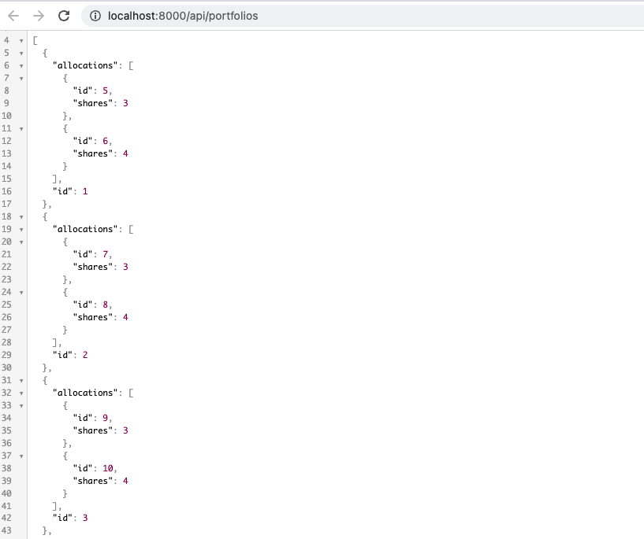

<h1 align="center">
  🐘🎯 Finizens' FullStack Challenge with Symfony - By Yeisson Vélez (08/05/23 - 12/05/23)
</h1>

## 👨‍💻Front
<!--suppress HtmlDeprecatedAttribute -->
<p align="center">
    
</p>

## 🚄 Apis
<!--suppress HtmlDeprecatedAttribute -->
<p align="left">
    
</p>

This project is made with [Symfony][1] 6.2.10

### 🐳 Needed tools

1. PHP 7.4 or higher;
2. Composer
3. PDO-MySQL PHP extension enabled;
4. PHP CS Fixer
5. and the [usual Symfony application requirements][2].

### 🛠️ Environment configuration

1. Create a local environment file (`cp .env .env.local`) if you want to modify any parameter

### 🔥 Application execution

1. Install the backend dependencies: `composer install`.
2. Create database & tables with `php bin/console d:d:c` then `php bin/console make:migration`
   and `php bin/console migration:migrate` or force with `php bin/console d:s:u -f`
3. Start the server with Symfony: `symfony serve`.
   Then access the application in your browser at the given URL ([https://localhost:8000](https://localhost:8000) by
   default).
   If you don't have the Symfony binary installed, run `php -S localhost:8000 -t public/`
   to use the built-in PHP web server or [configure a web server][3] like
   Apache to run the application.


### ✅ Tests execution

1. Install the dependencies if you haven't done it previously: `composer install`
2. Execute PHPUnit tests: `php bin/phpunit --configuration phpunit.xml.dist`

<!--suppress HtmlDeprecatedAttribute -->
<p align="left">
    
</p>


### 🎯 Hexagonal Architecture

This project follows the Hexagonal Architecture pattern. Also, it's structured using `modules`.
With this, we can see that the current structure of a Bounded Context is:

```scala
$ tree -L 5 src
    
src
├── Application // The application layer of our app
│   └── UseCase // Inside the application layer all is structured by actions
│       └── Order
│           ├── AddOrderUseCase.php
│           └── AddSellOrderUserCase.php
│           └── GetOrderUserCase.php
│           └── GetPorfolioOrdersUserCase.php
│       └── Portfolio
│           ├── AddPortfolioUseCase.php
│           └── GetPortfoliosUseCase.php
│           └── GetPortfolioUseCase.php
│           └── PutPortfolioUseCase.php
│           └── ShowPortfoliosUseCase.php
├── Domain // The domain layer of our app
│   ├── Event
│   └── Model
│       └── Entity
│           └── Allocation.php
│           └── Customer.php
│           └── Order.php
│           └── Portfolio.php
├── Infrastructure // The layer infrastructure of our app
│   ├── Persistence
│   │     └── Doctrine   
│   │         └── AllocationRepository.php
│   │         └── CustomerRepository.php
│   │         └── OrderRepository.php
│   │         └── PortfolioRepository.php
│   └── Service
├── UI // The layer UI of our app
│   ├── Cli
│   ├── Console
│   │   └── Command   
│   └── Http   
│       ├── Controller
│       │   └── DefaultController.php
│       │   └── OrderController.php
│       │   └── PortfolioController.php
│       └── templates
│           ├── default
│           │   └── index.html.twig
│           ├── portfolio
│           │   └── index.html.twig
│           │   └── portfolio-created.html.twig
│           └── base.html.twig
└── Kernel.php
```

### 🛠️ Extra tool -> Code style fixer

```console
tools/php-cs-fixer/vendor/bin/php-cs-fixer fix src
```
<!--suppress HtmlDeprecatedAttribute -->
<p align="left">
    
</p>

[1]: https://symfony.com/doc/6.2.10/index.html

[2]: https://symfony.com/doc/6.2.10/setup.html#technical-requirements

[3]: https://symfony.com/doc/6.2.10/setup/web_server_configuration.html

